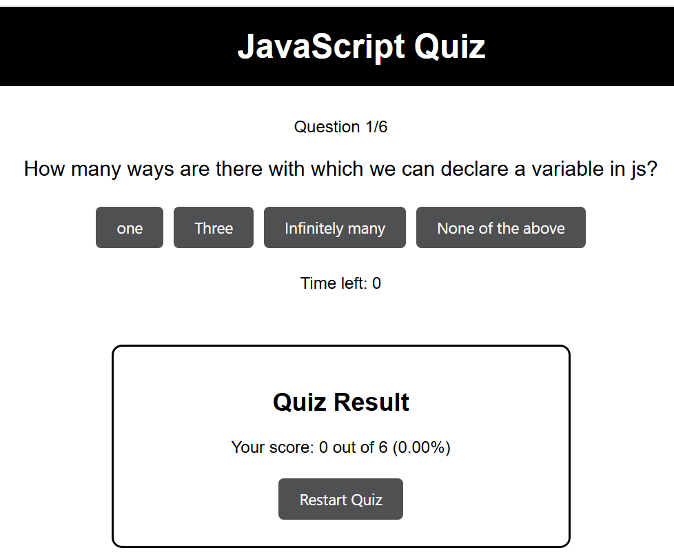

#  Portfolio Project – Navya Gujjula

## 📌 About
This is my **personal portfolio website** built with **React, Redux, and modern web technologies**.  
It showcases my **skills, projects, and achievements** with a clean, responsive design and smooth animations.

---

## 🚀 Live Demo
🔗 [View Live Project](http://192.168.31.100:3000)
---

## ✨ Features
- 🎨 Modern and responsive UI (works on all devices)
- 🌙 Dark/Light theme support
- 📂 Project showcase with images
- 📬 Contact form with MongoDB + Express backend
- ⚡ Smooth animations with Framer Motion

---

## 🛠️ Tech Stack
- **Frontend:** React,  MUI, Framer Motion  
- **Backend:** Node.js, Express.js  
- **Database:** MongoDB (Atlas/Compass)  
- **Deployment:**  Netlify (frontend)

---

### 🔹 Projects

---

